# SimpleDrive

SimpleDrive is a self-hosted personal cloud drive written in Go. It serves a
folder on your machine through a fast web UI where you can browse, upload,
preview, and share your files. Deployment is a single binary; there is no database, Docker setup, or required runtime dependencies.

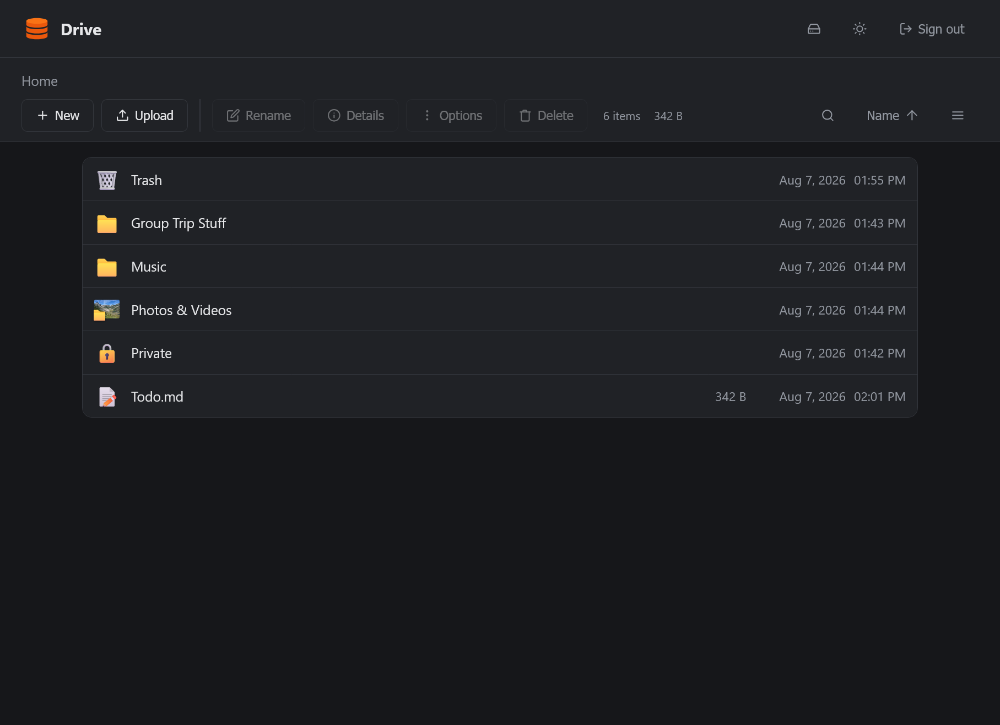

Use SimpleDrive for sensitive data at your own risk. This is a relatively new software and may contain security flaws.

## Installation

A cheap VPS running Debian/Ubuntu is perfect for SimpleDrive. Installation should take 5-10 minutes if you're already familiar with the tools used below.

**1. Download the binary** into the directory you want to run it from (we'll assume `/opt/simpledrive`):

```sh
sudo mkdir -p /opt/simpledrive
cd /opt/simpledrive
sudo curl -Lo simpledrive https://github.com/camdowney/simpledrive/releases/latest/download/simpledrive-linux-amd64
sudo chmod +x simpledrive
```

On an ARM server (Ampere, Graviton, Raspberry Pi), swap `amd64` for `arm64`.
Check with `uname -m`: `x86_64` means amd64, `aarch64` means arm64.

To upgrade later, download the new binary over the old one and restart the
service; your config and data are untouched.

<details>
<summary>Building from source instead</summary>

Requires [Go](https://go.dev/) 1.22 or newer.

```sh
git clone https://github.com/camdowney/simpledrive.git
cd simpledrive
go build -o simpledrive .
```

</details>

**2. Run setup to create a config file:**

```sh
./simpledrive setup -username X -password Y -root-dir Z -addr :8080
```

The password must be at least 12 characters.

**3. Check that it starts:**

```sh
./simpledrive
```

Stop it with Ctrl+C; the next step takes over running it.

**4. Keep it running with systemd.** Create
`/etc/systemd/system/simpledrive.service`:

```ini
[Unit]
Description=SimpleDrive
After=network.target

[Service]
User=simpledrive
WorkingDirectory=/opt/simpledrive
ExecStart=/opt/simpledrive/simpledrive
Restart=on-failure

[Install]
WantedBy=multi-user.target
```

This assumes the binary and `config.json` sit in `/opt/simpledrive` and run as a
`simpledrive` user; point the paths at wherever you put it. Then enable and start it:

```sh
sudo systemctl enable --now simpledrive
```

**5. Put HTTPS in front of it.** [Caddy](https://caddyserver.com/) handles this
automatically with a few lines of config. Add this to your `Caddyfile` (e.g.
`/etc/caddy/Caddyfile`):

```
drive.yourdomain.com {
	reverse_proxy localhost:8080
}
```

Reload Caddy (`sudo systemctl reload caddy`) and SimpleDrive is now available at
`https://drive.yourdomain.com`.

Set `trusted_proxy` to `true` in `config.json` once you are behind a real
reverse proxy, so login rate limiting sees the visitor's address rather than the
proxy's. Leave it off otherwise, since the header it trusts is easy to spoof.

## Adding ffmpeg (optional)

Optionally, install [ffmpeg](https://ffmpeg.org/) (which includes ffprobe).
SimpleDrive uses it for video thumbnails, video durations, and video and
audio editing tools. Without it, everything else works normally.

```sh
sudo apt install ffmpeg
```

## Features

### Files and folders

Browse, upload, download, rename, move, copy, delete, and create files and folders from
the web UI.

**Resumable uploads:** Files over 8 MB upload in slices in case the connection drops. Partly-sent uploads live in an `.uploads`
folder at the root of your drive.

**Trash bin:** Deleting local files move them to a `.trash` folder at the root of your drive
instead of erasing it, and offers an undo. Enable "show hidden files" to browse it.

**Storage breakdown:** The disk icon in the header breaks down the storage utilization of your drive.

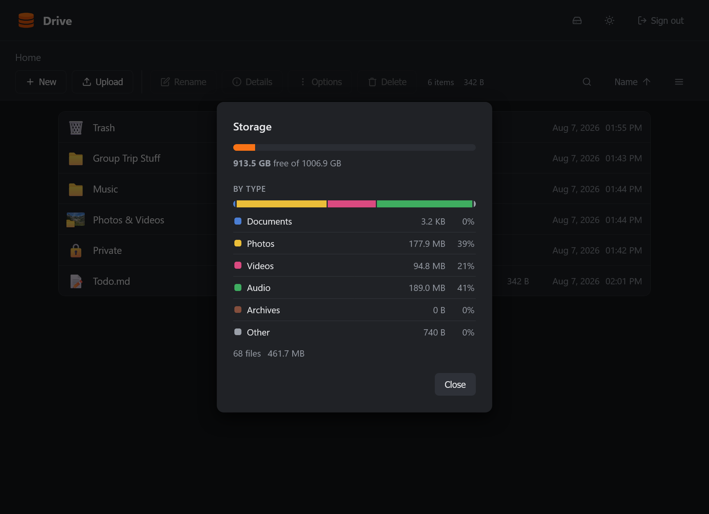

### Rich text

Use Markdown for a docs-like rich text experience. `.md` files open in a WYSIWYG editor: headings, bold, lists, tables, and links render as you type rather than as raw syntax. Why Markdown? It's platform independent and can open in any OS's default text editor.

Other text files open in a plain text editor.

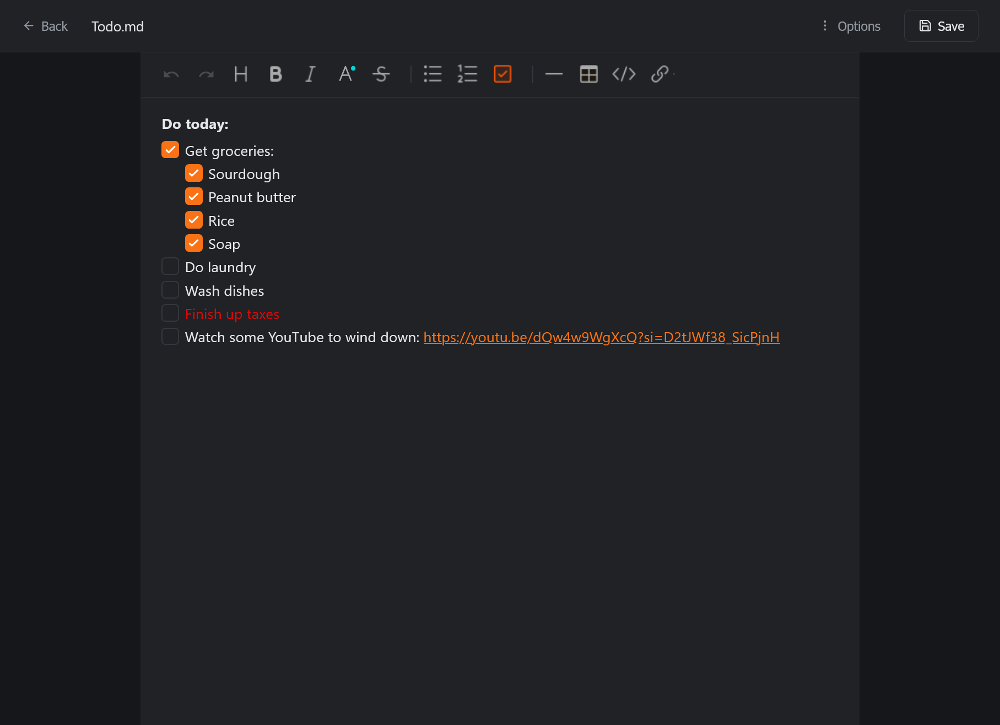

### Photos and videos

Images and videos get thumbnails and a built-in preview, backed by an on-disk
cache. Video thumbnails require ffmpeg.

**Photo resizing:** Scale a photo to a target size and quality.

**Video resizing:** Re-encode a video to 720p, 1080p, or 1440p H.264. Runs as a background job with progress and cancellation. Requires ffmpeg.

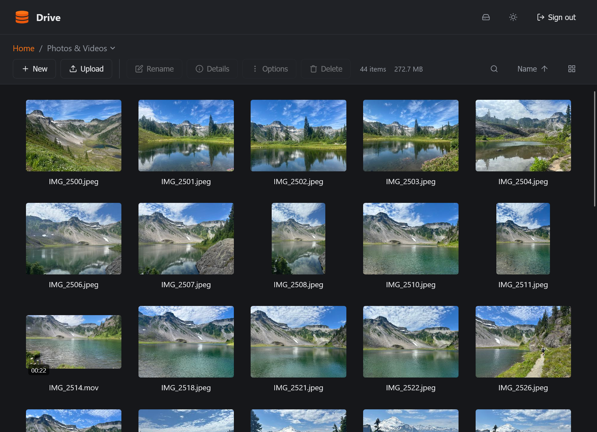

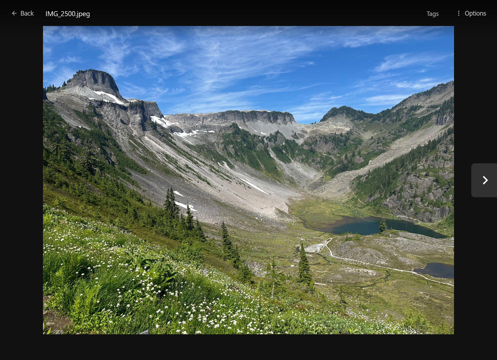

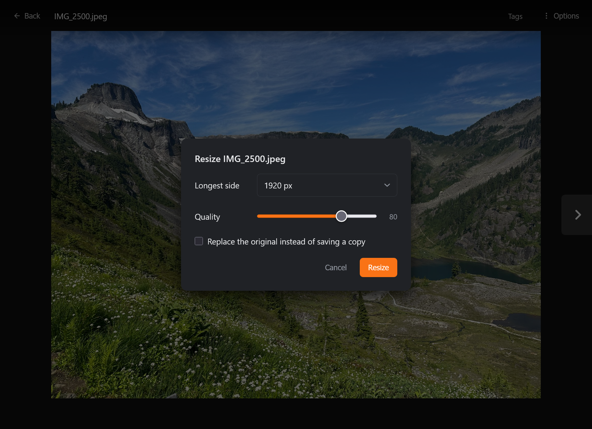

### Audio

**Tags (playlists):** Tags are color-coded labels on files, especially used for filtering music
and building playlists. While audio is playing, turn on autoplay or shuffle
and pick one or more tags to play through them.

**Autotag:** Adds a tag to an audio file if you listen past 15 seconds, and
removes it if you skip early, which builds a playlist as you listen. Set "untagged mix" at 0% to sift through existing tags, up to 100% to audition new audio only.

**Smart volume:** Play every track at a consistent
loudness. Disabled on iOS; requires ffmpeg.

**Audio trimming:** Cut a song down to a selected span. Requires ffmpeg.

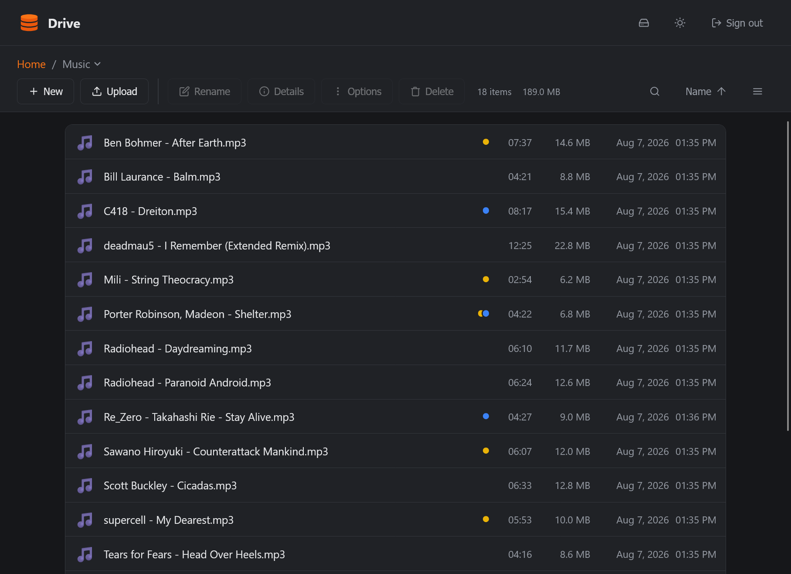

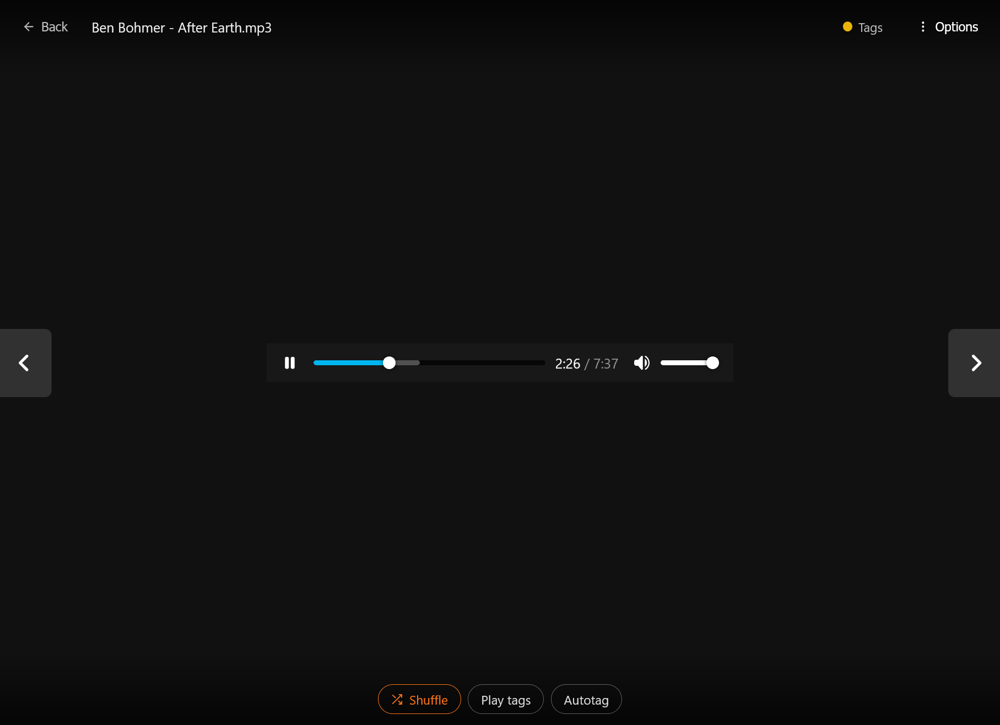

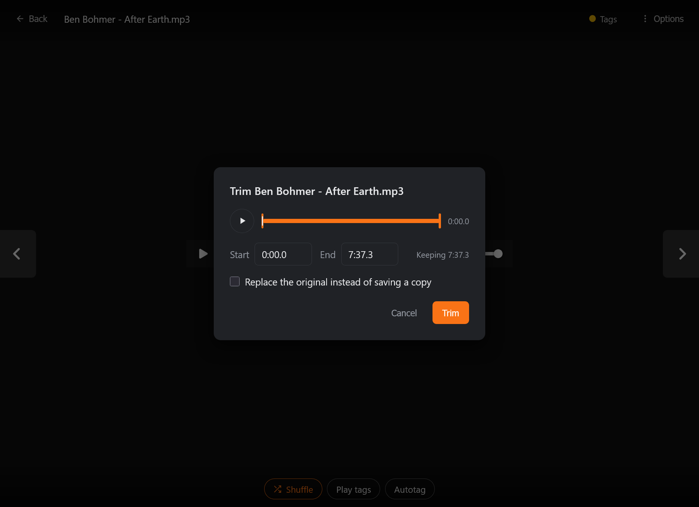

### Sharing

Share links give others access to a file or folder. Links can be view-only, view and edit, or drop box mode.

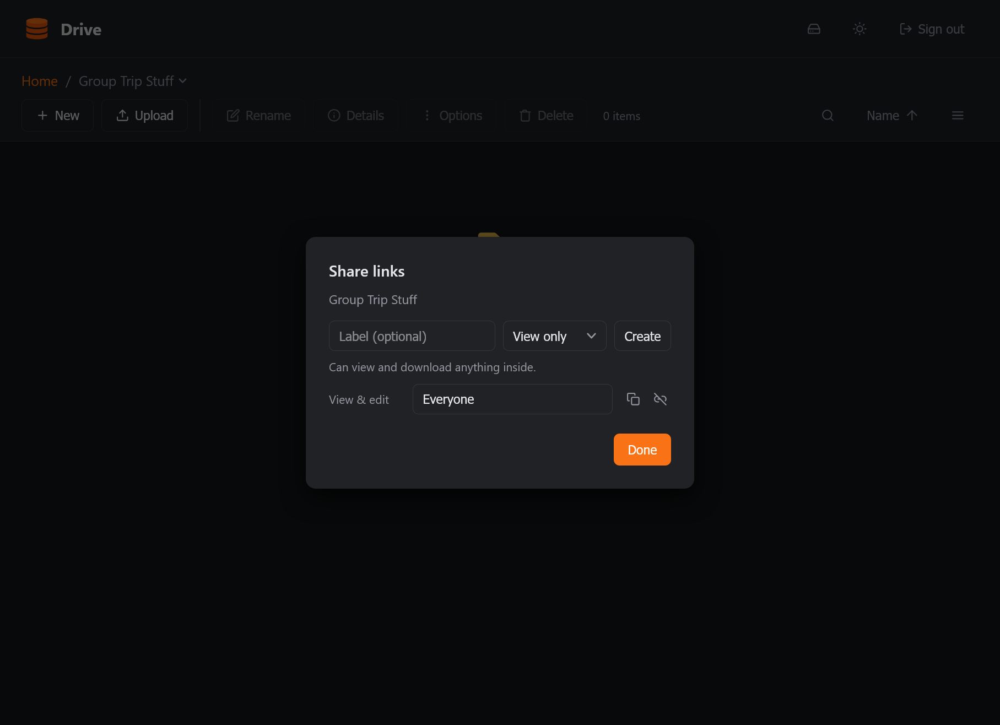

### S3-compatible mounts

External S3-compatible buckets can be mounted alongside
local storage and appear as folders at the root of the drive.

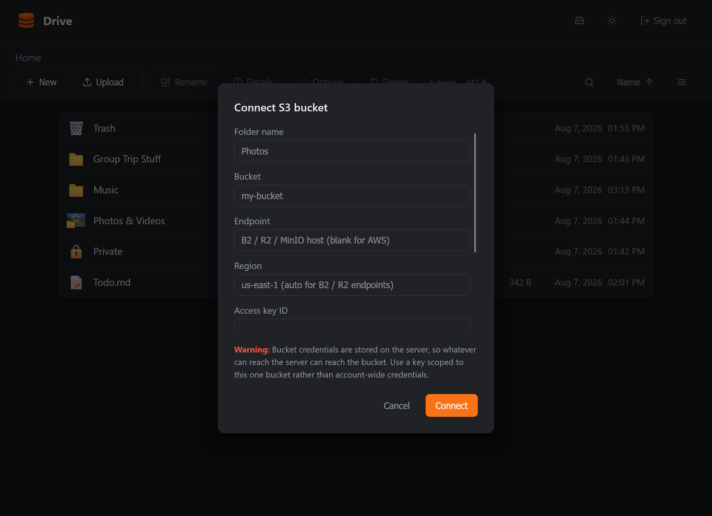

### Vaults

A vault is a folder whose contents are encrypted with
[age](https://age-encryption.org) before they leave your browser. The server
stores opaque blobs under random names and cannot read them, even while you have
the vault open. Enter a password to read the contents; the vault can be re-locked via the "Lock" button, by closing the browser tab, or automatically after 15 minutes of inactivity.

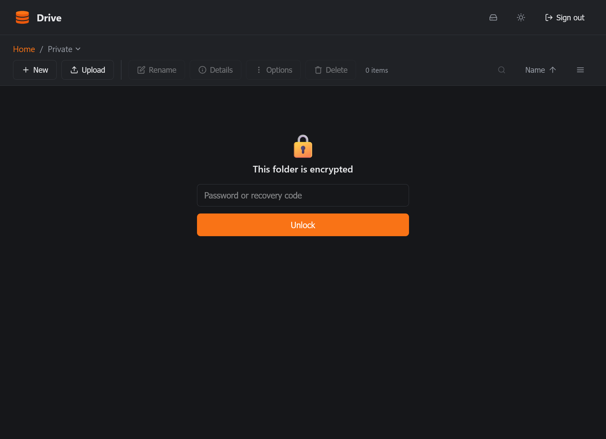

**Limitations:** Vaults deliberately have no thumbnails, no search, no
share links, and no media tools.

**Recovery code:** Creating a vault shows a one-time recovery code. It is the
only way in if you forget the passphrase, and there is no reset. Make sure to save it.

**Getting your files back without SimpleDrive:** Every vault contains a
plaintext `RECOVERY.md` explaining this, so a backup of the folder carries its
own instructions. Using only the standard `age` CLI:

```sh
age -d vault.key.age > vault.key     # prompts for your passphrase
age -d -i vault.key index.age        # prints blob id -> filename as JSON
age -d -i vault.key <blob-id> > my-file.pdf
```

## Configuration

`setup` writes all seven keys below into `config.json`. Edit it in place to change anything.

| Key             | Setup flag       | Default | Meaning                                                                |
| --------------- | ---------------- | ------- | ---------------------------------------------------------------------- |
| `addr`          | `-addr`          | `:8080` | Listen address. Required at setup; `-addr` at startup overrides it.    |
| `root_dir`      | `-root-dir`      | —       | Directory served as the drive. Required.                               |
| `username`      | `-username`      | —       | Login username. Required.                                              |
| `password_hash` | `-password`      | —       | bcrypt hash of the password. Required; `setup` generates it.           |
| `session_hours` | `-session-hours` | `48`    | Session lifetime. Absent from `config.json`, it is 24.                 |
| `trash_days`    | `-trash-days`    | `7`     | Days a deleted file stays in `.trash`. Negative keeps it indefinitely. |
| `trusted_proxy` | `-trusted-proxy` | `false` | Trust `X-Real-IP`. Only enable behind a real reverse proxy.            |

Alongside `config.json`, the server keeps `thumbcache/` (thumbnails),
`prefs.json` (UI preferences), `tags.json` (tag catalog and assignments),
`mounts.json` (S3 mount definitions, including credentials), `shares.json`
(share tokens), and `trash.json` (where each trashed file came from). Keep `config.json` itself outside `root_dir`; anything inside it is servable, and several of these files hold secrets.

## AI Disclaimer

Large portions of SimpleDrive were developed with AI tools. If you're allergic to AI,
I 100% understand and would recommend you stay far away from this project. I hold many
reservations about it as well. That being said, SimpleDrive to me represents AI usage at its best.
I wanted solutions that didn't exist but could never find the time to
develop them from scratch. SimpleDrive is now a tool I use every single day, and the value
it's provided me is immeasurable. All I can hope is that someone else out there will find value in it too!
